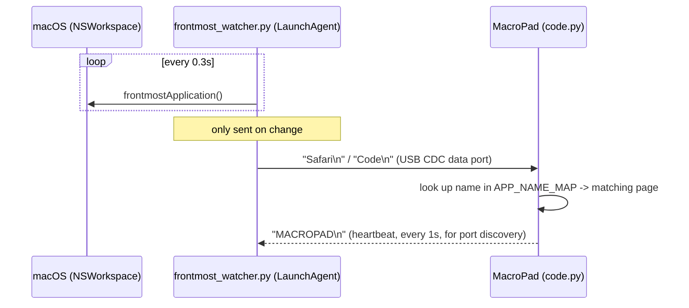

# MacroPad Frontmost-App Auto-Switcher

Turn an [Adafruit MACROPAD RP2040](https://www.adafruit.com/product/5128) into a
context-aware macro keyboard: it automatically shows the right set of
shortcuts for whichever application is currently in the foreground on your
Mac — no manual switching required.

Based on Adafruit's original [MACROPAD Hotkeys](https://learn.adafruit.com/macropad-hotkeys)
CircuitPython example, extended with:

- **Automatic profile switching** based on the frontmost macOS application
- **Manual override** — turning the encoder still lets you pick any page by
  hand, and it stays put until you switch to a different app
- **Encoder push button** repurposed as a 4-step key-backlight brightness
  control (off → 33% → 66% → 100%)
- A small **host-side watcher script** + **LaunchAgent** that finds the
  MacroPad automatically, regardless of which USB port/hub it's plugged into

## How it works

The MacroPad itself has no way to know which application is focused on your
Mac — CircuitPython has no access to that information. So the system has two
halves:



1. **`host/frontmost_watcher.py`** runs in the background on your Mac (via a
   LaunchAgent), polls the frontmost application via `NSWorkspace` (pyobjc),
   and sends its name over a serial USB connection whenever it changes.
2. **`code.py`** on the MacroPad receives that name, looks it up in
   `APP_NAME_MAP`, and switches to the matching macro page. If the frontmost
   app isn't mapped, it falls back to whichever page you last picked
   manually — so occasional apps without a dedicated page never destroy your
   manual selection.

## Hardware / software requirements

- Adafruit MACROPAD RP2040 (or compatible) running CircuitPython 8/9
- A Mac running macOS (uses `NSWorkspace`, so this part is macOS-only; the
  MacroPad side is platform-independent)
- Python 3 on the Mac, with `pyserial` and `pyobjc-framework-Cocoa`

## Project structure

```
boot.py             - enables the second USB-CDC data port
code.py              - main MacroPad program (profile switching + macros)
lib/                 - required CircuitPython libraries (copy as-is)
macros/              - one file per application profile
host/
  frontmost_watcher.py            - background script, runs on the Mac
  requirements.txt                - Python deps for the host script
  com.example.macropad-watcher.plist - LaunchAgent template
```

## Installation

### 1. Flash CircuitPython

Follow [Adafruit's guide](https://learn.adafruit.com/adafruit-macropad-rp2040/circuitpython)
to install CircuitPython on the MacroPad if you haven't already.

### 2. Copy the project onto the MacroPad

With the MacroPad plugged in, its CIRCUITPY drive should be mounted. Copy
everything from this folder **except `host/`** onto the drive root
(`boot.py`, `code.py`, `lib/`, `macros/`):

```bash
rsync -av --delete \
  --exclude='host' --exclude='.DS_Store' --exclude='._*' \
  ./ /Volumes/CIRCUITPY/
```

Eject/replug the board once so `boot.py` takes effect and the second serial
(data) port becomes available. You should then see two `/dev/cu.usbmodem...`
devices.

### 3. Set up the host script

Create an isolated virtual environment (recommended, so the script doesn't
depend on whatever Python happens to be active in your shell — important
since LaunchAgents don't load your shell profile):

```bash
cd host
python3 -m venv .venv
.venv/bin/pip install -r requirements.txt
```

Test it manually first:

```bash
.venv/bin/python3 frontmost_watcher.py
```

Switch applications on your Mac and watch the MacroPad display change. Stop
with Ctrl-C once it works.

### 4. Run it automatically via LaunchAgent

Edit `com.example.macropad-watcher.plist` and replace
`/path/to/macropad-frontmost-switcher` with the absolute path where you put
this project. Then:

```bash
cp com.example.macropad-watcher.plist ~/Library/LaunchAgents/
launchctl bootstrap gui/$(id -u) ~/Library/LaunchAgents/com.example.macropad-watcher.plist
```

Check status / logs:

```bash
launchctl print gui/$(id -u)/com.example.macropad-watcher
tail -f /tmp/macropad-watcher.log /tmp/macropad-watcher.err
```

Stop / reload after changes:

```bash
launchctl bootout gui/$(id -u)/com.example.macropad-watcher
launchctl bootstrap gui/$(id -u) ~/Library/LaunchAgents/com.example.macropad-watcher.plist
```

## Configuration

### Adding / editing macro pages

Each file in `macros/` defines one profile:

```python
app = {
    'name': 'VS Code',          # shown on the OLED, must be unique across all files
    'macros': [
        # (color, label, key sequence)
        (0xFFFFFF, 'Save', [Keycode.COMMAND, Keycode.S]),
        # ... up to 12 entries (one per key)
    ]
}
```

The 13th "macro" slot (the encoder button) is **not used** for macros in this
setup — the encoder push button is hard-wired in `code.py` to cycle the LED
brightness instead.

### Mapping frontmost apps to pages

Edit `APP_NAME_MAP` in `code.py`:

```python
APP_NAME_MAP = {
    'Safari': 'Mac Safari',   # <macOS frontmost name> : <app['name'] in macros/*.py>
    'Code': 'VS Code',
}
```

### Finding the macOS name of an app

`NSWorkspace.frontmostApplication().localizedName()` doesn't always match the
menu-bar name exactly (e.g. `Code` for VS Code, `Live` for Ableton Live,
localized names like `Musik`/`Music` depending on system language). Two ways
to find it:

1. Add a `print(name)` line in `frontmost_watcher.py`'s main loop, run it in
   a terminal, and activate the app you want to map.
2. Or ask macOS directly:
   ```bash
   osascript -e 'tell application "System Events" to name of first application process whose frontmost is true'
   ```

## Troubleshooting

- **Nothing switches automatically**: check `launchctl print
  gui/$(id -u)/com.example.macropad-watcher` shows `state = running`, and
  look at `/tmp/macropad-watcher.err` for Python errors (commonly a missing
  `pyobjc`/`pyserial` install, or a wrong path in the plist).
- **App names never change in the log**: querying `NSWorkspace` from a
  plain command-line process can occasionally return a stale, cached value
  if the surrounding process never processes any Cocoa run-loop events. This
  setup avoids that by querying fresh on every loop iteration rather than
  caching across a longer sleep — if you still see stuck values, try adding
  a short `AppKit.NSRunLoop` spin, or switch to observing the
  `NSWorkspaceDidActivateApplicationNotification` instead of polling.
- **Debugging communication**: temporarily add `print(...)` calls in
  `frontmost_watcher.py` (e.g. `print("sent", name)`) and a
  `serial.write(...)` confirmation in `code.py` after `apps[app_index].switch()`
  to trace both directions of the connection.

## License

The original MACROPAD Hotkeys example is © 2021 Phillip Burgess / Adafruit
Industries, licensed under MIT. This project's modifications are released
under the same MIT license — see the header comments in `code.py`.
